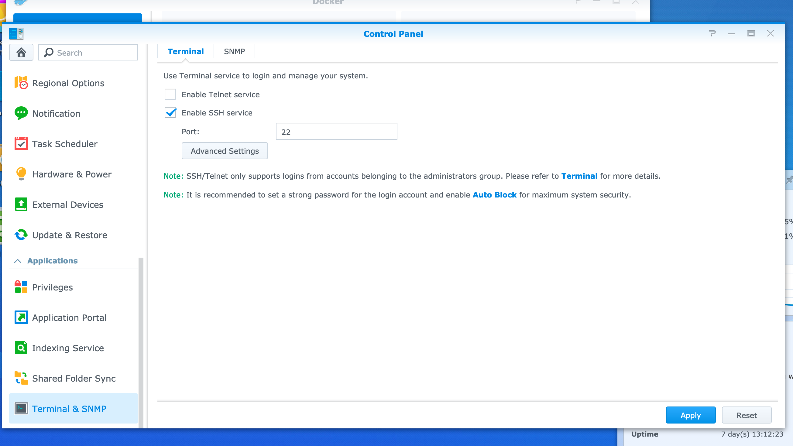
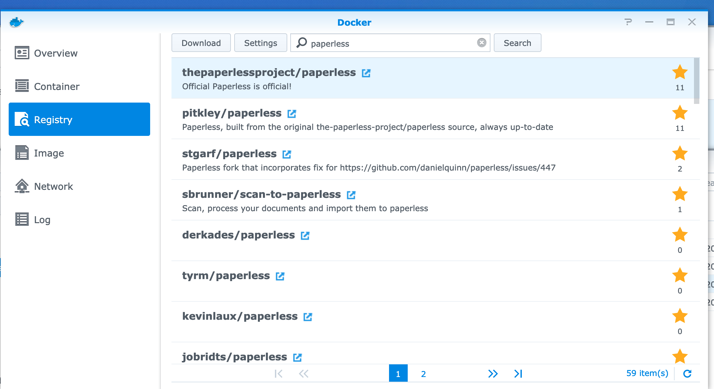
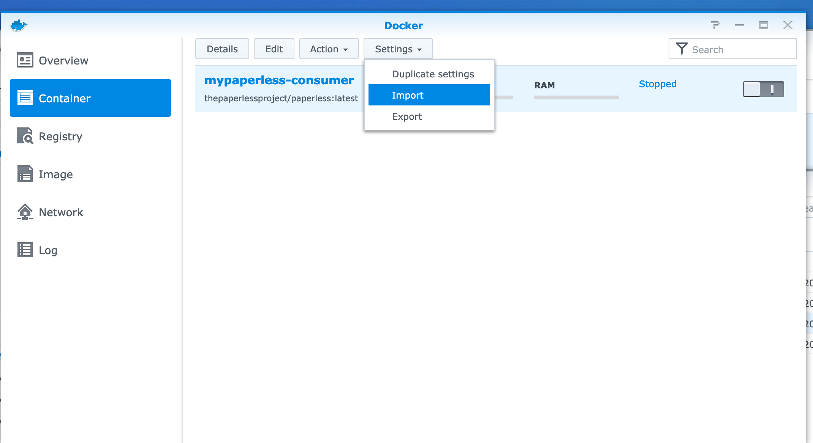
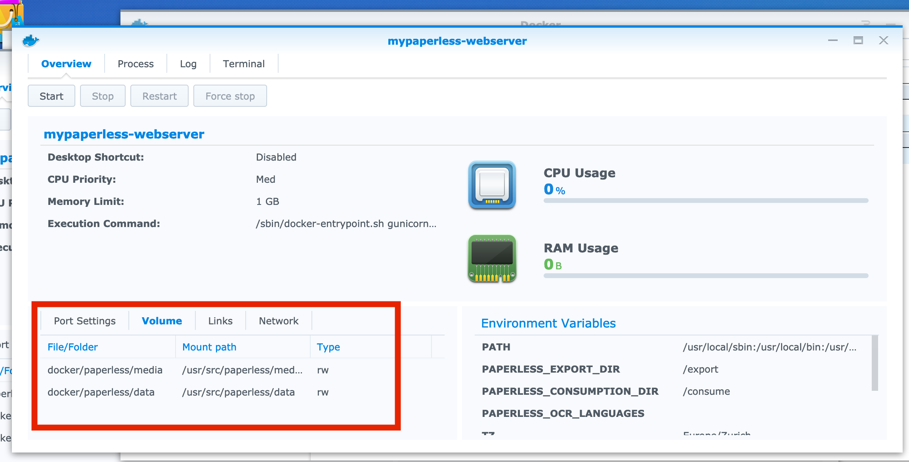
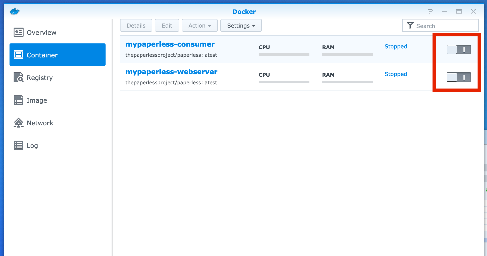
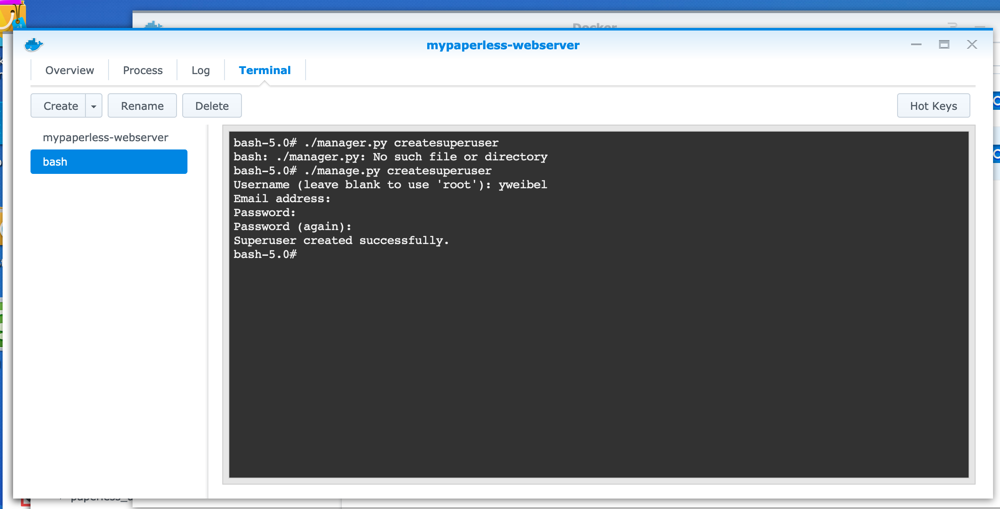

# Paperless on Synology

As I went through some troubles to setup paperless on my Synology, I wanted to document it for others. I'm using a `DS218+` with DSM 6.2.3 and docker installed using the `Package Center`.

## Create required directories

Paperless requires three mount points to be configured:

* a `consume` directory from which paperless consumes the new document
* a `data` directory in which paperless creates its database
* a `media` directory in which paperless stores documents

You can use any directory you want but you need to correctly set the permissions. Configuring paperless with a user and group Id that are allowed to read/write these directories is required. 

For the `consume`, I have personally created a new share that my scanner can write to. 

### Getting the user and group Ids

You can find all userId and groupId in the `/etc/pwd` file of you NAS - I didn't find a better way to get them. You can proceed as follows:

1. enable the SSH server from the `Control Panel`. 
2. connect to you NAS using SSH
3. run the following command on your NAS: `more /etc/pwd`
4. for security reasons, it is recommended to disable the SSH server after you have retrieved the user and group Ids.

## Download the paperless image

Using the docker UI app, search for `paperless` in the `Registery` tab. Double click on image called `thepaperlessproject/paperless:latest` to download it.



## Import the configuration

Using the Docker UI, in the `Container` tab, click on `setting > import` and import the two following configurations:

* [Consumer configuration](mypaperless-consumer.json) 
* [Web Server configuration](mypaperless-webserver.json) 

These configurations are the ones I used on my setup. You have to edit them to match your configuration before the import.

Change the language (English is by default the first one) and timezone:

```
{
         "key" : "PAPERLESS_OCR_LANGUAGES",
         "value" : "fra deu"
},
{
         "key" : "TZ",
         "value" : "Europe/Zurich"
},
```

Change the userId and groupId with the ones you have retrieved earlier:

```
{
    "key" : "USERMAP_UID",
    "value" : "1034"
},
{
    "key" : "USERMAP_GID",
    "value" : "100"
},
```

Update the directories bindings. You have to change every `host_volume_file` with the path matching your configuration, the other parameters should stay as they are.

```
"volume_bindings" : [
    {
        "host_volume_file" : "/scanner/paperless_consume",
        "mount_point" : "/consume",
        "type" : "rw"
    },
    {
        "host_volume_file" : "/docker/paperless/media",
        "mount_point" : "/usr/src/paperless/media",
        "type" : "rw"
    },
    {
        "host_volume_file" : "/docker/paperless/data",
        "mount_point" : "/usr/src/paperless/data",
        "type" : "rw"
    }
]
```



Once your container has been created, make sure the disk mapping has been correctly imported. I had some issues with the mapping import in the beginning: in my case, it was due to permission issues. If the import does not work out of the box, you can try to edit the container in the UI and re-create the mapping.



## Start the consumer

Using the Docker UI, start the `consumer` from the `Container` tab. To start the container, click on the I/O switch. Using the same UI, check the logs for no error. 



At the first start, a `db.sqlite3` should get created in the `data` directory and a `document` folder in the media directory.

## Start the webserver

Start the webserver container using the same Docker UI and check the logs for no error.

Once it's up and running, create the user you will use to access paperless:

* From the terminal tab, `create` a new terminal. 
* In the terminal, type `./manage.py createsuperuser` to create a new user.
* Provided the `username` and `password` you want to use to access paperless.
* Then browse to `http://<your-nas-ip>:8000`



## Create an SSL certificate

TODO: Enabling this will require ssl.key and ssl.cert files in paperless' data directory.

## Useful links

* doc: https://paperless.readthedocs.io/en/latest/setup.html
* synology: https://github.com/the-paperless-project/paperless/issues/385
* ssl: https://code.luasoftware.com/tutorials/nginx/self-signed-ssl-for-nginx-and-chrome/

